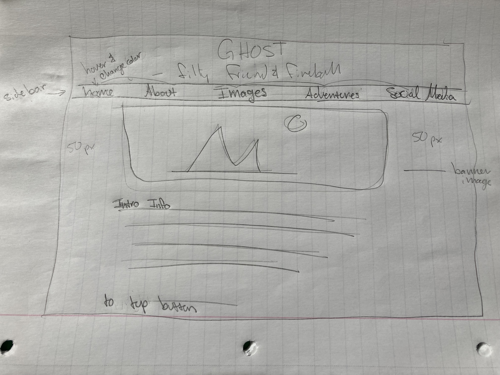

# Assignment 11

## Madelyn Nordby

### Questions

1. Padding is the space in between your box and content. Everything is in a box and the padding gives visual relief by creating some space within the contents.
Margins are the space between everything else, keeping us from bumping borders, web page edge, and so on.
Borders, like the previous two, help define the area... but are more of visual design. They can be colored, changed, and morphed to be more visually obvious.

2. 

3. This one was tricky because I didn't want to do it exactly like the walkthrough so I had alot of extra trial and error to get this site to be relatively close to my mind's eye. I think I got the hang of it the longer I struggled but there are for sure aspects that I have no idea what I did right to get it there!
