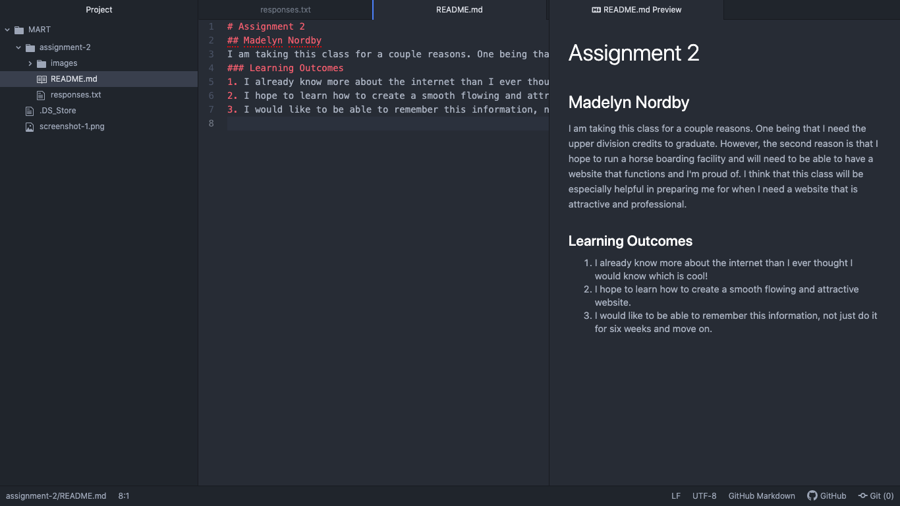

# Assignment 2
## Madelyn Nordby
I am taking this class for a couple reasons. One being that I need the upper division credits to graduate. However, the second reason is that I hope to run a horse boarding facility and will need to be able to have a website that functions and I'm proud of. I think that this class will be especially helpful in preparing me for when I need a website that is attractive and professional.
### Learning Outcomes
1. I already know more about the internet than I ever thought I would know which is cool!
2. I hope to learn how to create a smooth flowing and attractive website.
3. I would like to be able to remember this information, not just do it for six weeks and move on.

#### Links
[Phil Haugen](https://philhaugenhorsemanship.com)

[Responses](./responses.txt)

