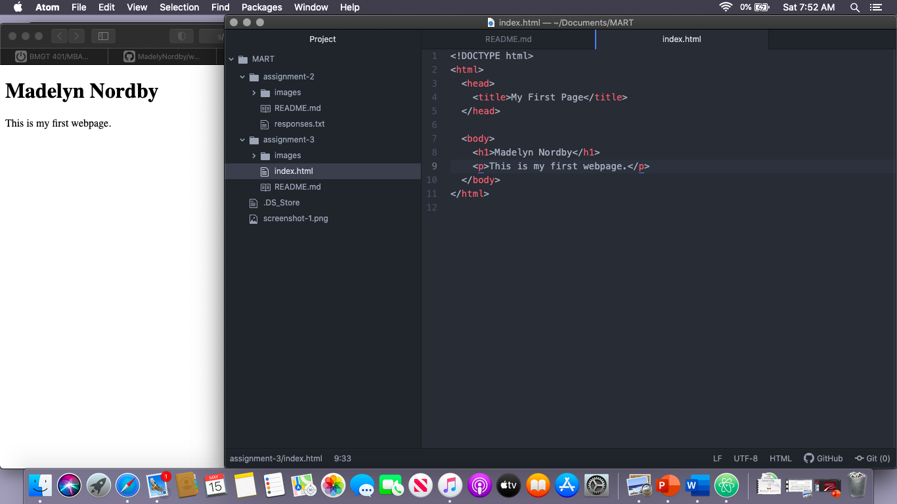

# Assingment 3
## Madelyn Nordby
### Question Repsonses
1. Browsers function through using a system of collaborative engines. We have the user interface that shows the user an inter active page for their search. Then the rendering engine does all the visual displaying and interpretation through using information retrieved by the browser engine. The rendering engine paints the webpage by using DOM and is so fast we don't see the little individual links forming and finishing. There is also network communication and Javascript interpretation which can vary based on the program used by the browser. Cookies are also included in your browser but you can edit them and see what websites are allowed to remember you.
2. Markup language is the language that web browsers use to interpret and compose the website. This tells what is text, image, video, audio, or otherwise interactive. The most common markup language is HTML which uses elements to describe everything. These elements are described through html tags like head, body, p for paragraph, and etc.

#### Personal Questions
I think I'm following pretty well, but my one question is why do we do both markdown and html? I know markdown from middle school so it's a little easier for me. But I was curious if it is also used in our websites or just for these README files?

The other question I have is if we need a specific website idea for this course? I have just been following your walkthroughs but was curious if our final websites should be based on one we want to make one day or just something random or what the criteria for that is.
