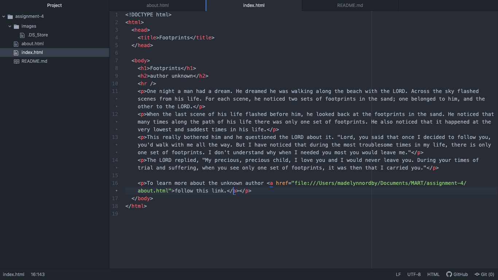

# Assignment 4

## Madelyn Nordby

### Question Repsonses
1. I used the way back machine to view East Rosebud Fly and Tackle. It was really wild to see how old it looked. It kinda looked like my current sad attempts at a website with the bare bones of information laid out with some pictures. Compared to the website I was used to it was a major back track.

2. This module was okay on a whole. I got more comfortable with html and I learned how to use the github desktop to move my assignments which is cool. I really really struggled with the images for my website. As a matter a fact I gave up because I couldn't figure out what I had done so completely wrong. I am a little frustrated about it and would appreciate some feedback on what I missed. The image links work but apparently not on my website so I don't know what happened or if I just did it all completely wrong.

