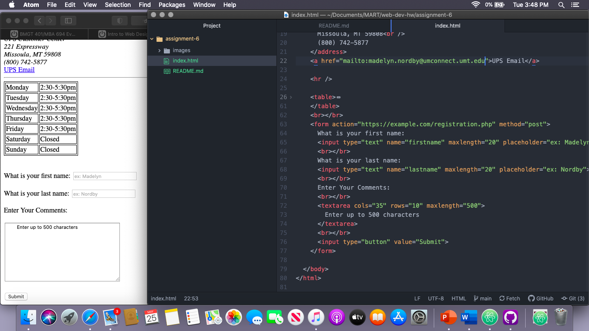

# Assignment 6

## Madelyn nordby

### Question Responses
1. Now that I know what forms are I see them all over the web! Starting from the first search bar that pops up! The first one that came to mind for me was the instagram login, but there are so many! The most often use of forms that I have come across are login screens, so there is the username and password section with a submit button.

2. From what I understand text, selection, and button input are for a more interactive website. These will let you type in information and submit it to access your private info or will submit info to the website that you gave as a review.

3. This was probably one of the most interesting modules for me so far. Understanding more about the websites that I use and being able to make the form that they use is really interesting! I worked through it pretty fluidly, my only struggle is being dyslexic I will flip things and then not understand why my code is working.

